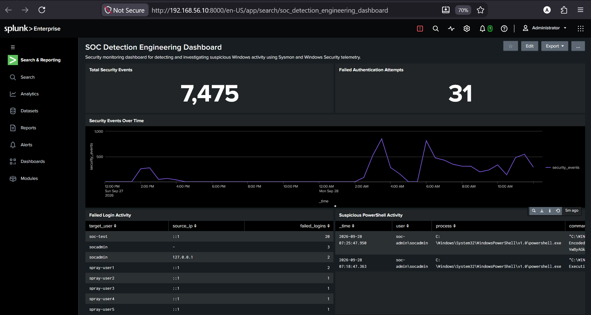
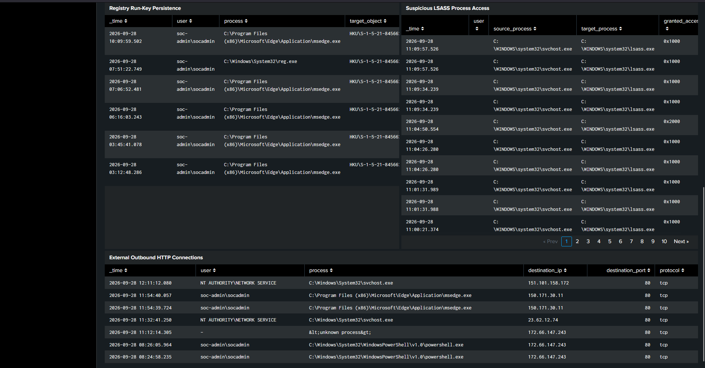
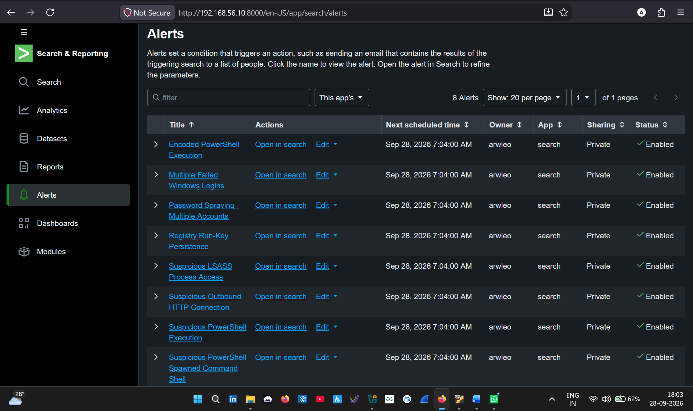

# SIEM Detection Engineering Lab

A hands-on blue-team project focused on building, testing, and investigating security detections using **Splunk Enterprise, Sysmon, Windows Security Logs, SPL, and MITRE ATT&CK**.

The lab simulates an entry-level Security Operations Center workflow: collecting endpoint telemetry, developing detection logic, generating controlled security events, validating alerts, investigating results, identifying potential false positives, and visualizing activity through a SOC dashboard.

---

## Project Overview

This project was built to develop practical experience with:

- SIEM monitoring and detection engineering
- Windows Security Event analysis
- Sysmon endpoint telemetry
- SPL query development
- Security alert creation
- Alert triage and investigation
- MITRE ATT&CK mapping
- True-positive / false-positive analysis
- Detection tuning
- SOC dashboard development
- Security documentation

A total of **8 detection rules** were developed and validated in the lab.

---

## Lab Architecture

```text
┌───────────────────────────────┐
│        Windows SOC VM         │
│       192.168.56.20           │
│                               │
│  Windows Security Logs        │
│  Sysmon                       │
│  Splunk Universal Forwarder   │
└───────────────┬───────────────┘
                │
                │ TCP 9997
                ▼
┌───────────────────────────────┐
│       Splunk Server           │
│       192.168.56.10           │
│                               │
│  Splunk Enterprise            │
│  SPL Searches                 │
│  Detection Rules              │
│  Scheduled Alerts             │
│  SOC Dashboard                │
└───────────────────────────────┘
```

### Environment

| Component | Purpose |
|---|---|
| Windows VM | Monitored SOC endpoint |
| Ubuntu Server | Splunk Enterprise server |
| Sysmon | Endpoint process, registry, network, and process-access telemetry |
| Windows Security Logs | Authentication telemetry |
| Splunk Universal Forwarder | Log forwarding |
| Splunk Enterprise | SIEM search, detection, alerting, and visualization |
| VirtualBox | Virtual lab infrastructure |

---

## Detection Engineering

| # | Detection | Telemetry | MITRE ATT&CK |
|---|---|---|---|
| 01 | Multiple Failed Windows Logins | Windows Event ID 4625 | T1110 |
| 02 | Password Spraying | Windows Event ID 4625 | T1110.003 |
| 03 | Suspicious PowerShell Execution | Sysmon Event ID 1 | T1059.001 |
| 04 | Encoded PowerShell Execution | Sysmon Event ID 1 | T1059.001 |
| 05 | Suspicious Process Creation | Sysmon Event ID 1 | Context dependent |
| 06 | Registry Run-Key Persistence | Sysmon Event ID 13 | T1547.001 |
| 07 | Suspicious LSASS Process Access | Sysmon Event ID 10 | T1003.001 |
| 08 | Suspicious Outbound HTTP Connection | Sysmon Event ID 3 | Context dependent |

Detailed detection logic, SPL queries, validation procedures, investigation guidance, and false-positive considerations are available in the [`detections`](./detections/) directory.

---

## Detection Examples

### Multiple Failed Logins

Detects five or more failed authentication attempts against the same account/source combination.

```spl
index=main source="WinEventLog:Security" "4625"
| rex field=_raw "<EventID[^>]*>(?<event_id>\d+)</EventID>"
| rex field=_raw "<Data Name=['\"]TargetUserName['\"]>(?<target_user>[^<]*)</Data>"
| rex field=_raw "<Data Name=['\"]IpAddress['\"]>(?<source_ip>[^<]*)</Data>"
| search event_id=4625
| stats count AS failed_logins BY target_user source_ip
| where failed_logins >= 5
```

### Password Spraying

Identifies failed authentication attempts targeting five or more unique accounts from the same source.

```spl
index=main source="WinEventLog:Security" "4625"
| rex field=_raw "<Data Name=['\"]TargetUserName['\"]>(?<target_user>[^<]*)</Data>"
| rex field=_raw "<Data Name=['\"]IpAddress['\"]>(?<source_ip>[^<]*)</Data>"
| stats dc(target_user) AS unique_accounts count AS failed_attempts BY source_ip
| where unique_accounts >= 5
```

### Encoded PowerShell

Detects PowerShell process creation containing encoded-command parameters.

```spl
index=main source="WinEventLog:Microsoft-Windows-Sysmon/Operational"
| rex field=_raw "<EventID[^>]*>(?<event_id>\d+)</EventID>"
| rex field=_raw "<Data Name=['\"]Image['\"]>(?<process>[^<]*)</Data>"
| rex field=_raw "<Data Name=['\"]CommandLine['\"]>(?<command_line>[^<]*)</Data>"
| search event_id=1 process="*powershell.exe"
| where like(lower(command_line), "%encodedcommand%") OR like(lower(command_line), "% -enc %")
```

---

## SOC Detection Dashboard

A Splunk dashboard was developed to provide centralized visibility into endpoint and authentication telemetry.

The dashboard includes:

- Total security events
- Failed authentication attempts
- Security event trends
- Failed login activity
- Suspicious PowerShell activity
- Registry Run-Key activity
- LSASS process access
- External outbound HTTP connections

### Dashboard Overview



### Detection Investigation Panels



---

## Splunk Alerts

All eight detection searches were configured as scheduled Splunk alerts.

The lab used:

- Scheduled execution
- 1-minute detection schedule
- 5-minute search window
- Result-based triggering
- Medium severity
- Triggered-alert tracking



---

## Investigation & Detection Tuning

The project was designed to go beyond simply generating alerts.

During investigation, several examples demonstrated why **alert context and tuning are important in SOC operations**.

### Registry Activity

Legitimate applications generated Run-key registry modifications in addition to the controlled persistence test.

This demonstrated that a registry persistence detection should not automatically classify every Run-key modification as malicious.

Useful investigation context includes:

- Process responsible for modification
- Registry value
- Executable path
- User context
- Surrounding process activity

### LSASS Access

Normal Windows processes can legitimately interact with `lsass.exe`.

Therefore, Sysmon Event ID 10 should be evaluated using additional context such as:

- Source process
- Process path
- Granted access rights
- User context
- Process ancestry

The lab simulated LSASS process access only and did **not** perform credential dumping.

### Network Connections

External HTTP connections can be generated by legitimate applications.

The outbound-connection detection therefore provides investigation telemetry rather than treating every external connection as command-and-control activity.

This also demonstrates why MITRE ATT&CK mappings should be based on observed behavior rather than assigned solely because a network connection exists.

---

## Alert Investigation Workflow

The lab followed a basic SOC investigation process:

```text
Security Event
      ↓
Splunk Detection
      ↓
Alert Triggered
      ↓
Review Event Context
      ↓
Analyze User / Process / IP / Command Line
      ↓
Correlate Related Events
      ↓
Determine Expected vs Suspicious Activity
      ↓
Document Findings
      ↓
Tune Detection if Required
```

---

## MITRE ATT&CK Coverage

The validated detections demonstrate telemetry related to:

- **T1110 — Brute Force**
- **T1110.003 — Password Spraying**
- **T1059.001 — PowerShell**
- **T1547.001 — Registry Run Keys / Startup Folder**
- **T1003.001 — LSASS Memory**

ATT&CK mappings were only assigned where the observed behavior provided sufficient context.

---

## Troubleshooting Experience

Building the lab also required troubleshooting the monitoring pipeline.

Examples included:

- Configuring Splunk Universal Forwarder
- Enabling Splunk receiving on TCP 9997
- Troubleshooting Sysmon Event Log collection
- Running the forwarder under the appropriate Windows service context
- Validating connectivity between Windows and Splunk
- Troubleshooting Sysmon NetworkConnect/Event ID 3 telemetry
- Isolating Sysmon configuration issues using a minimal test configuration
- Verifying telemetry locally before validating ingestion in Splunk

This reinforced an important monitoring principle:

> Validate telemetry at each stage of the pipeline before troubleshooting the detection logic.

---

## Skills Demonstrated

**SIEM & Detection**
- Splunk Enterprise
- SPL
- Detection Engineering
- Scheduled Alerts
- Security Monitoring

**Endpoint Security**
- Sysmon
- Windows Security Events
- Process Creation Analysis
- Registry Monitoring
- Process Access Analysis
- Network Connection Monitoring

**SOC Operations**
- Alert Triage
- Log Analysis
- Incident Investigation
- False-Positive Analysis
- Detection Tuning
- Security Documentation

**Threat Detection**
- Brute-Force Detection
- Password-Spray Detection
- PowerShell Monitoring
- Persistence Detection
- Credential-Access Monitoring
- Network Activity Analysis
- MITRE ATT&CK

**Infrastructure**
- Windows
- Ubuntu Linux
- Splunk Universal Forwarder
- VirtualBox
- TCP/IP

---

## Repository Structure

```text
SIEM-Detection-Engineering-Lab/
│
├── README.md
│
├── detections/
│   ├── 01-multiple-failed-logins.md
│   ├── 02-password-spraying.md
│   ├── 03-suspicious-powershell.md
│   ├── 04-encoded-powershell.md
│   ├── 05-suspicious-process-creation.md
│   ├── 06-registry-run-key-persistence.md
│   ├── 07-lsass-process-access.md
│   └── 08-outbound-http-connection.md
│
└── screenshots/
    ├── 01-soc-dashboard-overview.png
    ├── 02-soc-dashboard-detections.png
    └── 03-splunk-detection-alerts.png
```

---

## Key Takeaways

This project provided practical experience building a small detection-engineering workflow from endpoint telemetry collection through SIEM investigation.

The main lessons were:

1. A detection firing does not automatically mean malicious activity occurred.
2. Windows and Sysmon telemetry must be interpreted in context.
3. Detection thresholds and allowlists require tuning.
4. Process ancestry, command lines, users, registry paths, and network activity provide valuable investigation context.
5. MITRE ATT&CK mappings should reflect observed behavior rather than assumptions.
6. Reliable telemetry collection is a prerequisite for reliable detection engineering.

---

## Disclaimer

All activity in this project was performed in an isolated personal lab using controlled test scenarios and disposable accounts. The project is intended solely for defensive cybersecurity learning and detection-engineering practice.
